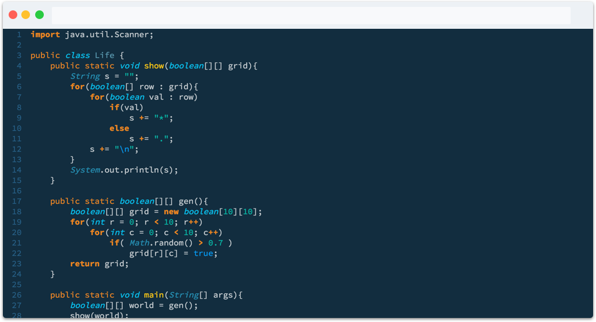

#  Tempo Theme

A dark theme made by [Tempo](https://tempo.io), featuring our signature Tempo colors. Themes for other editors can be found [here](https://tempo-theme.github.io).

## Installation
This extension is available in the [jetbrains plugins repository](https://plugins.jetbrains.com/plugin/10641-tempo-theme-color-scheme)

To install the Tempo Theme:

**Manually**
  1. Download the plugin from the link above
  2. Open *Preferences > Editors > Color Scheme > Import Scheme*
  3. Choose the downloaded jar file and click apply or OK

**Via plugins repository**
  1. Open *Preferences > Plugins > Browse repositories* 
  2. Search "Tempo Theme"
  3. Install

## Screenshots
You can use the Tempo theme with the most popular languages, including:

### Javascript

### CSS

### Python

### Java

## About Tempo
Tempo is a top-selling, award-winning Atlassian ecosystem vendor. We create solutions for tracking time, planning projects, and managing business costs.
 Check us out at [tempo.io](https://tempo.io).